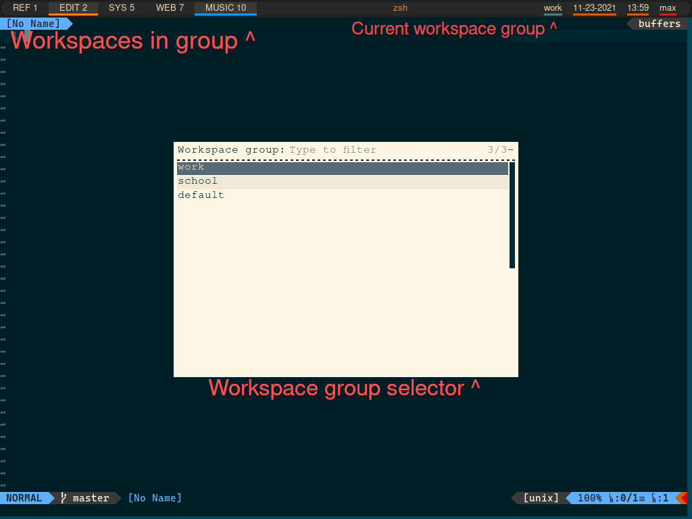

# i3-ws-groups
Add workspace groups to the i3 window manager to easily switch between sets of workspaces. <br>
Create or switch to a workspace group and use the set of workspaces in that group



Significantly expands i3 multitasking capability by allowing users to have a set of related workspaces easily accessible for a specific purpose <br>

For instance, I used it in college to have a workspace group for each class, with each class having its own relevant reading material, web pages, editor, etc.

## Features
* Full set of workspaces available per workspace group
* Set specific workspaces as easily accessible from any workspace, using `[order_number]:const:[name]`
* Create or switch workspaces using rofi selector
* Move windows between groups using `i3-ws-groups selector` without `--instant`, then move windows to desired workspace in newly selected group

## Installation
* Patch polybar using `i3-ws-groups-polybar.patch` (can easily create patches for other status bars)
* Add `i3-ws-groups` to PATH
* Add to i3 configuration (example in `example_configs/i3-config`)
  * Add initialization <br>
    `exec --no-startup-id "i3-ws-groups init"`
  * Change workspace switch bindings <br>
    `bindsym $mod+1 workspace 1` -> `bindsym $mod+1 exec "i3-ws-groups ws-switch 1:1"` <br>
    (workspaces must be referenced as `[order_number]:[name]` for current group workspace or <br>
    `[order_number]:const:[name]` to be accessible from any workspace group)
  * Change workspace window move bindings <br>
    `bindsym $mod+Shift+1 move container to workspace 1:1` -> `bindsym $mod+Shift+1 exec "i3-ws-groups ws-move 1:1"`
  * Add workspace group selector bindings <br> 
    `bindsym Mod1+n exec "i3-ws-groups selector --instant"` <br>
    `bindsym Mod1+Shift+n exec "i3-ws-groups selector"` (used to switch windows between groups)
* Add current workspace name display to polybar (example in `example_configs/polybar-config`)
  * Add to bar modules
    `modules-right = i3-ws-group date time username powermenu`
  * Add module definition
    ```
    [module/i3-ws-group]
    type = custom/script
    exec = i3-ws-groups current
    interval = 1
     ```

## Dependencies
* python3
* rofi
* jq
