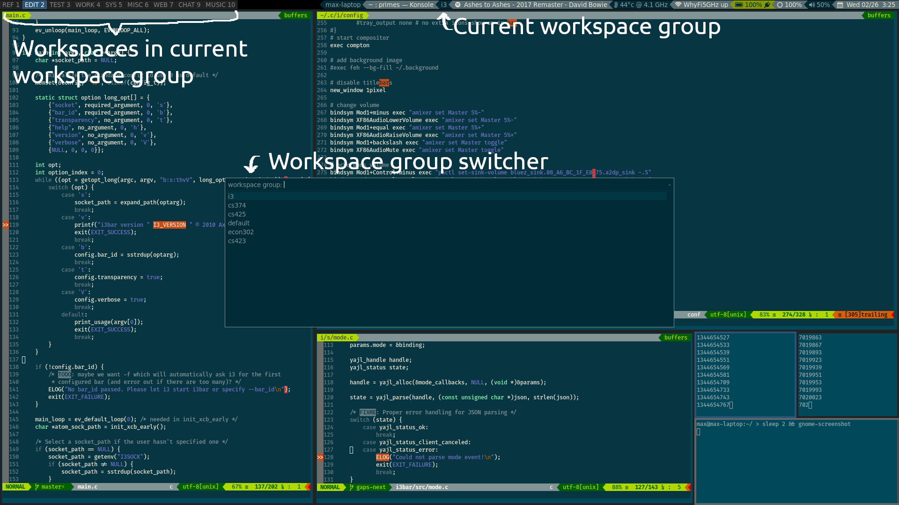

# i3-ws-groups

## What is i3-ws-groups?

i3-ws-groups is a fork of [i3-gaps](https://github.com/Airblader/i3), a tiling window manager for X11. It is kept up to date with upstream, adding a few additional features such as workspace groups.

Picture taken from my current hacky implementation which I fear the consequences of unleashing upon the world...also, yes, I like the solarized theme

# Features

### workspace groups

Each set of namespaces belongs to a group, allowing a user to separate workspaces for unrelated tasks.
For instance, one can maintain editing, testing, and reference workspaces for several different projects and switch between them at any time using a dialog like [Rofi](https://github.com/davatorium/rofi). When not working on a given project, one can simply switch to another workspace group and the workspaces associated with that project simply get out of the way until you switch back to the workspace.

### global workspaces

Workspaces which are accesible from all workspace groups without switching the current group. For instance, a workspace labeled "MUSIC" could be configured to be global, as it would likely not be project-specific.

# Goals
* minimal footprint
* clean interface, almost indistinguishable from the typical i3 interface
* minimal additional keybindings

# Roadmap
Currently implemented with a minimal patch to i3 and a Python script. It's super hacky, though it seems to work for the most part. I would like to implement it in a better, more thought-out way.

# Motivation
I naturally found myself wanting this feature through frustration with only 10 easily accessible workspaces in i3. I iterated on a few different systems with varying levels of effectiveness. 

Eventually I was inspired by [i3-workspace-groups](https://github.com/infokiller/i3-workspace-groups), but found the solution inadequate. A big problem with i3-workspace-groups was that it did not seem to support my flow of named (not numbered) workspaces while maintaining the typical clean i3 interface.

Also, I have found [i3groups](https://github.com/Ceryn/i3groups) which does a lot right, but seems to overhaul default i3 behavior more than I would like, amongst other things.
